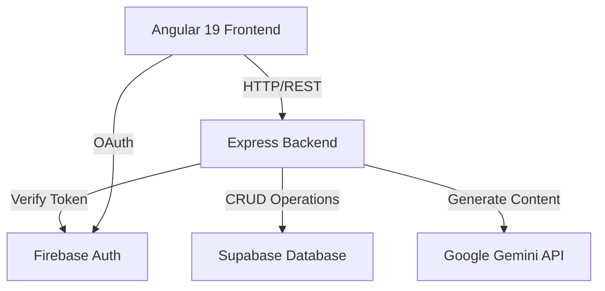
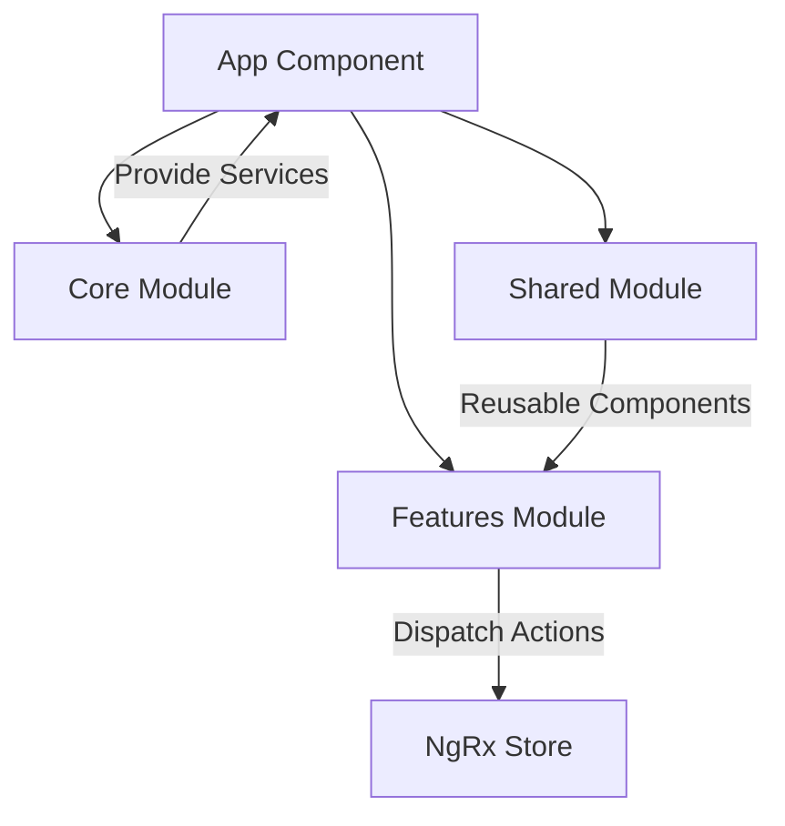
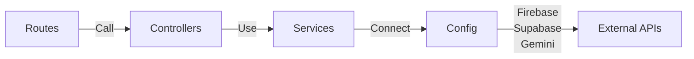
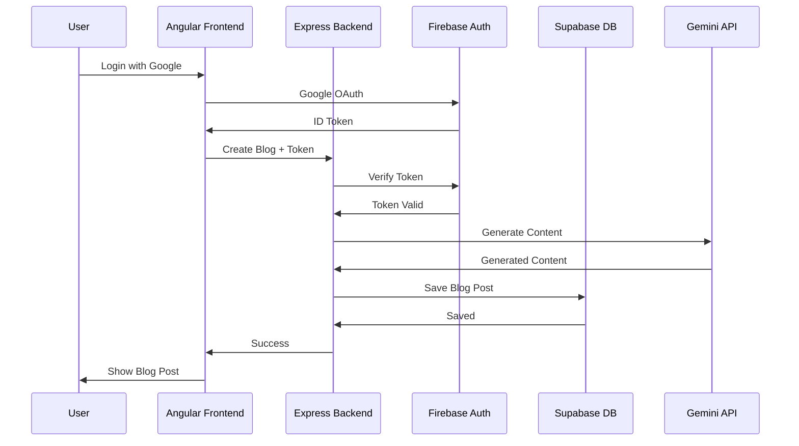

# Postorale

A modern Medium-like blogging platform built with Angular 19, Node.js (Express), and Google Gemini.

## Overview

**Postorale** is a full-stack blogging application that empowers users to create, share, and discover high-quality content. Leveraging cutting-edge technologies like AI-powered content generation via Google Gemini, real-time authentication with Firebase, and a scalable backend with Supabase, Postorale provides a seamless blogging experience.

### Key Features
- 📝 **AI-Powered Blog Generation** - Generate blog content using Google Gemini API
- 🔐 **Secure Authentication** - Google OAuth and JWT-based authentication
- 💾 **Real-time Data** - Supabase for database and real-time updates
- 🎨 **Modern UI** - Angular 19 with PrimeNG components and TailwindCSS
- 🏪 **State Management** - NgRx store for predictable state management
- 🔧 **Scalable Backend** - Express.js with structured architecture

## Architecture

### System Architecture


### Frontend Architecture


### Backend Architecture


## Project Structure

### Frontend Structure (`/postorale`)
- **`app/components/`** - Reusable UI components (Navbar, Sidebar)
- **`app/core/`** - Singleton services, constants, and interfaces
- **`app/features/`** - Feature modules (Auth, Dashboard, Home)
- **`app/pages/`** - Page-level components
- **`app/store/`** - NgRx state management (Auth, Blogs, UI)
- **`app/shared/`** - Shared utilities and components

### Backend Structure (`/backend`)
- **`src/config/`** - Firebase and Supabase configuration
- **`src/controllers/`** - Request handlers (AI, Blog, Auth)
- **`src/routes/`** - API endpoints
- **`src/middlewares/`** - Authentication and validation middleware
- **`src/interfaces/`** - TypeScript type definitions

## Setup Instructions

### 1. Backend Setup

1. Navigate to the backend directory:
   ```bash
   cd backend
   ```
2. Install dependencies:
   ```bash
   npm install
   ```
3. Configure Environment Variables:
   - Create a `.env` file in `backend/` based on `backend/.env.example` (or the created `.env`).
   - Fill in:
     - `SUPABASE_URL` & `SUPABASE_KEY`
     - `FIREBASE_SERVICE_ACCOUNT` (Path to JSON)
     - `GEMINI_API_KEY`
4. Start the server:
   ```bash
   npm run dev
   ```

### 2. Frontend Setup

1. Navigate to the root directory.
2. Install dependencies (updated with NgRx/Firebase):
   ```bash
   npm install
   ```
3. Start the Angular app:
   ```bash
   npm start
   ```

## Features Implemented

### Frontend Features
- **Authentication Module**
  - Google OAuth integration via Firebase
  - JWT token-based session management
  - Signup and login components with validation
  - Protected routes with auth guards

- **Blog Management**
  - Create, read, update, and delete blog posts
  - Real-time blog listings with NgRx state management
  - Blog filtering and search capabilities
  - Comment system for user engagement

- **UI/UX Components**
  - PrimeNG component library for consistent design
  - TailwindCSS for responsive styling
  - Navbar and sidebar navigation
  - Reusable button and card components
  - Server-side rendering support (Angular 19)

### Backend Features
- **Authentication System**
  - Google OAuth token verification
  - JWT token generation and validation
  - Protected routes with middleware
  - Session management

- **Blog API Endpoints**
  - CRUD operations for blog posts
  - User blog filtering
  - Comment management
  - Real-time sync with Supabase

- **AI Integration**
  - Google Gemini API integration
  - AI-powered blog content generation
  - Context-aware content suggestions

- **Data Persistence**
  - Supabase PostgreSQL database
  - Firebase authentication service
  - Real-time database subscriptions

### Architecture Highlights
- **Core/Shared/Features Pattern** - Modular and scalable application structure
- **NgRx State Management** - Predictable state management with actions, reducers, and selectors
- **Dependency Injection** - Angular's built-in DI system for loose coupling
- **Middleware Pattern** - Express middleware for authentication and validation
- **TypeScript** - Strongly typed codebase for better developer experience
- **Responsive Design** - Mobile-first approach with TailwindCSS

## Technology Stack

### Frontend
| Technology | Purpose |
|-----------|---------|
| **Angular 19** | Frontend framework with standalone components |
| **NgRx** | State management library |
| **TypeScript** | Type-safe JavaScript |
| **TailwindCSS** | Utility-first CSS framework |
| **PrimeNG** | UI component library |
| **Firebase** | Authentication service |

### Backend
| Technology | Purpose |
|-----------|---------|
| **Node.js** | JavaScript runtime |
| **Express** | Web framework |
| **TypeScript** | Type-safe JavaScript |
| **Supabase** | PostgreSQL database & API |
| **Firebase** | Authentication & services |
| **Google Gemini** | AI content generation |

## Data Flow



## API Endpoints

### Authentication Routes
- `POST /api/auth/login` - Login with Google
- `POST /api/auth/logout` - Logout user
- `POST /api/auth/verify` - Verify JWT token

### Blog Routes
- `GET /api/blogs` - Get all blogs
- `GET /api/blogs/:id` - Get blog by ID
- `POST /api/blogs` - Create new blog
- `PUT /api/blogs/:id` - Update blog
- `DELETE /api/blogs/:id` - Delete blog

### AI Routes
- `POST /api/ai/generate` - Generate blog content
- `POST /api/ai/enhance` - Enhance existing content

### Comment Routes
- `GET /api/comments/:blogId` - Get comments for blog
- `POST /api/comments` - Add comment
- `DELETE /api/comments/:id` - Delete comment

## Getting Started

### Prerequisites
- Node.js 18+ 
- npm or yarn
- Google Gemini API key
- Supabase account
- Firebase project

### Quick Start
Follow the setup instructions in the **Setup Instructions** section above to get both frontend and backend running locally.
